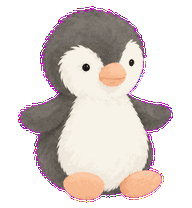
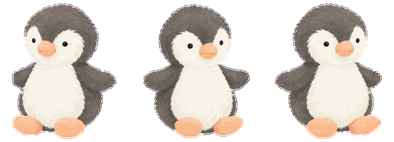
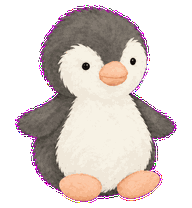

# Peanut Penguin for Codex

一隻以 Jellycat Peanut Penguin 鑰匙圈版為原型的 Codex 桌面寵物：炭灰、奶油白與淡蜜桃配色，搭配少量柔和筆觸，保留毛絨玩偶的呆萌感。

歡迎下載作為自己的 Codex 桌面寵物使用。

**[直接下載寵物素材包 ZIP](https://github.com/pin0501/peanut-penguin-codex-pet/releases/latest/download/peanut-penguin-codex-pet.zip)** · [透明背景插畫](peanut-penguin-illustration.png)



## 安裝

1. 下載並解壓縮 ZIP，找到內含 `pet.json` 與 `spritesheet.webp` 的 `peanut-penguin-illustrated` 資料夾。
2. 將整個資料夾放到 Codex 的 `pets` 目錄：

   | 系統 | 預設位置 |
   | --- | --- |
   | Windows | `%USERPROFILE%\.codex\pets\` |
   | macOS / Linux | `~/.codex/pets/` |

   若已自訂 `CODEX_HOME`，請改放在該目錄下的 `pets` 子目錄，例如 `$CODEX_HOME/pets/`。目錄不存在時可自行建立。

3. 在 Codex 開啟 **設定 → 寵物 → 重新整理**，選擇 **Peanut Penguin**，再喚醒寵物。

安裝後的結構應為：

```text
pets/
└── peanut-penguin-illustrated/
    ├── pet.json
    └── spritesheet.webp
```

更新時，以新版覆蓋同名寵物資料夾中的兩個檔案，再重新整理並重新選擇寵物。操作入口可參考 [OpenAI 寵物說明](https://learn.chatgpt.com/zh-Hant/docs/pets)。

## 動作預覽

包含九組動作：不動、右跑、左跑、揮手、跳躍、失敗、等待、工作與檢視，以及十六個注視方向。

左右跑已以原始不動影格為基準修正頭身比、眼睛、短嘴及腳掌的比例。下圖依序為左跑／不動／右跑：





## 素材

| 路徑 | 內容 |
| --- | --- |
| `pet.json`、`spritesheet.webp` | 寵物原始檔案（ZIP 內已整理為可安裝的資料夾） |
| `peanut-penguin-codex-pet.zip` | 打包好的下載檔 |
| `peanut-penguin-illustration.png` | 透明背景主圖 |
| `*.gif` | 動畫預覽 |

寵物圖集採用 v2 格式：8 欄 × 11 列、每格 192 × 208 像素，整張 1536 × 2288 像素。

## English installation

Download the [ZIP](https://github.com/pin0501/peanut-penguin-codex-pet/releases/latest/download/peanut-penguin-codex-pet.zip), extract it, and copy the `peanut-penguin-illustrated` folder into `%USERPROFILE%\.codex\pets\` on Windows or `~/.codex/pets/` on macOS/Linux. If you use a custom `CODEX_HOME`, use its `pets` subfolder instead.

In Codex, open **Settings → Pets**, refresh the list, select **Peanut Penguin**, and wake the pet. The v2 sprite sheet includes nine animations and sixteen look directions.

## 原型與製作

這是使用 AI 協助繪製的非官方 fan art，原型為 [Jellycat Peanut Penguin Bag Charm](https://jellycat.com/peanut-penguin-bag-charm/)。本專案非 Jellycat 或 OpenAI 官方作品，亦不代表兩者背書。
